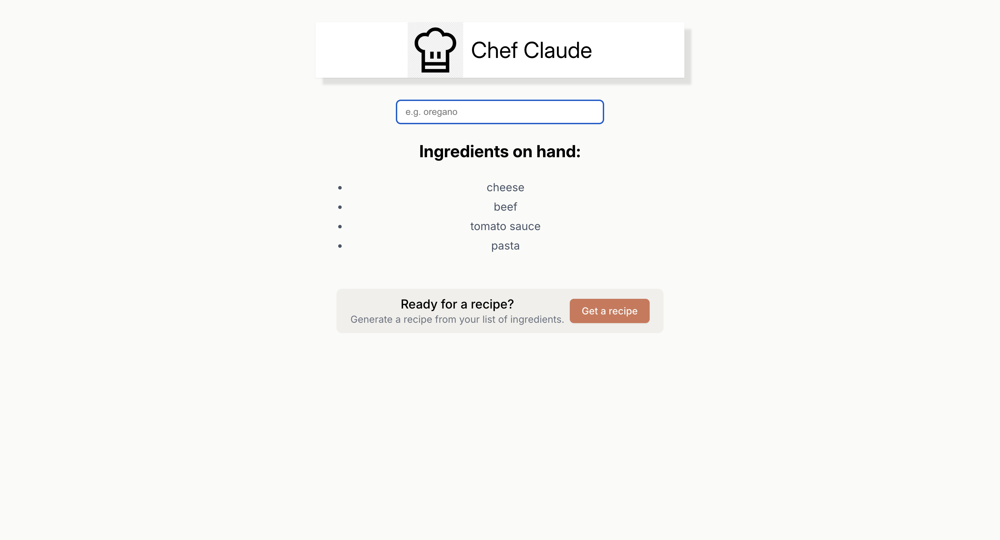

# 👨‍🍳 Chef Claude — Recipe Generator (React)

## 🔗 Live Demo

https://chef-claude-react.vercel.app/

**Chef Claude** is a fun and interactive React app that generates random recipes for you to try. It fetches data from an external API and displays details like the recipe name, ingredients, and an image — all wrapped in a clean, user-friendly interface.

This project was created to practice `useEffect`, API data fetching, and state management in React.

## 🧠 What I Practiced

- Fetching data from an external API using `fetch`.
- Managing asynchronous state with `useEffect` and `useState`.
- Conditional rendering based on loading/error/data state.
- Creating reusable components in React.

## ⚙️ Features

- Based on ingredients prompted, AI-generated recipe with Claude Anthropic API.
- Includes ingredients and instructions.


## 🚀 Getting Started

```
## 🖼️ Screenshot





